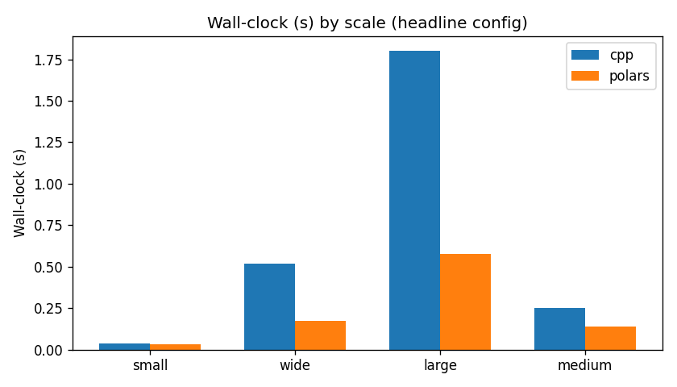
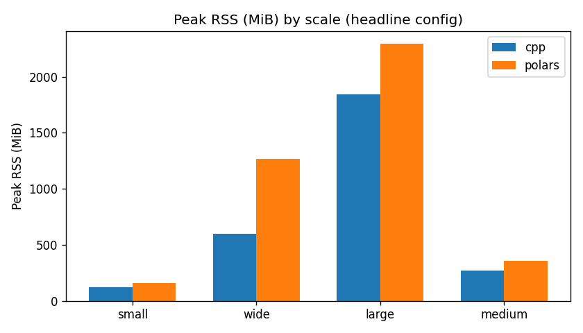

# meds_etl_cpp benchmark: Polars vs C++

## Environment

- **platform**: macOS-26.5.1-arm64-arm-64bit
- **processor**: arm
- **cpu_count**: 14
- **python**: 3.12.7
- **polars**: 1.35.2
- **pyarrow**: 22.0.0

## Results

| scale | rows | shards | threads | backend | wall best (s) | wall mean (s) | peak RSS | out size | out files |
|---|---|---|---|---|---|---|---|---|---|
| large | 10,000,000 | 14 | 14 | cpp | 1.800 | 1.840 | 1.8 GiB | 150.5 MiB | 14 |
| large | 10,000,000 | 14 | 14 | polars | 0.578 | 0.600 | 2.2 GiB | 119.1 MiB | 14 |
| medium | 1,000,000 | 1 | 1 | cpp | 0.723 | 0.754 | 187.6 MiB | 15.2 MiB | 1 |
| medium | 1,000,000 | 1 | 1 | polars | 0.286 | 0.289 | 285.1 MiB | 12.0 MiB | 1 |
| medium | 1,000,000 | 1 | 14 | cpp | 0.676 | 0.702 | 299.9 MiB | 15.2 MiB | 1 |
| medium | 1,000,000 | 1 | 14 | polars | 0.077 | 0.079 | 429.2 MiB | 12.0 MiB | 1 |
| medium | 1,000,000 | 14 | 1 | cpp | 0.786 | 0.803 | 119.1 MiB | 15.2 MiB | 14 |
| medium | 1,000,000 | 14 | 1 | polars | 0.285 | 0.295 | 193.8 MiB | 12.1 MiB | 14 |
| medium | 1,000,000 | 14 | 14 | cpp | 0.307 | 0.313 | 332.0 MiB | 15.2 MiB | 14 |
| medium | 1,000,000 | 14 | 14 | polars | 0.091 | 0.102 | 464.3 MiB | 12.1 MiB | 14 |
| medium | 1,000,000 | 56 | 1 | cpp | 0.756 | 0.776 | 92.9 MiB | 15.2 MiB | 56 |
| medium | 1,000,000 | 56 | 1 | polars | 0.395 | 0.402 | 180.6 MiB | 12.5 MiB | 56 |
| medium | 1,000,000 | 56 | 14 | cpp | 0.249 | 0.301 | 267.7 MiB | 15.2 MiB | 56 |
| medium | 1,000,000 | 56 | 14 | polars | 0.139 | 0.143 | 355.1 MiB | 12.5 MiB | 56 |
| small | 100,000 | 14 | 14 | cpp | 0.036 | 0.059 | 118.7 MiB | 1.5 MiB | 14 |
| small | 100,000 | 14 | 14 | polars | 0.030 | 0.037 | 159.0 MiB | 1.3 MiB | 14 |
| wide | 1,000,000 | 14 | 14 | cpp | 0.520 | 0.582 | 601.0 MiB | 32.3 MiB | 14 |
| wide | 1,000,000 | 14 | 14 | polars | 0.170 | 0.172 | 1.2 GiB | 27.4 MiB | 14 |

## Polars / C++ ratios (lower is better for Polars)

| scale | shards | threads | speed ratio | peak-RSS ratio |
|---|---|---|---|---|
| large | 14 | 14 | 0.32x | 1.25x |
| medium | 1 | 1 | 0.40x | 1.52x |
| medium | 1 | 14 | 0.11x | 1.43x |
| medium | 14 | 1 | 0.36x | 1.63x |
| medium | 14 | 14 | 0.30x | 1.40x |
| medium | 56 | 1 | 0.52x | 1.94x |
| medium | 56 | 14 | 0.56x | 1.33x |
| small | 14 | 14 | 0.84x | 1.34x |
| wide | 14 | 14 | 0.33x | 2.11x |

## Equivalence checks

- OK: small shards=14 threads=14 (polars == cpp)
- OK: medium shards=14 threads=14 (polars == cpp)
- OK: large shards=14 threads=14 (polars == cpp)
- OK: wide shards=14 threads=14 (polars == cpp)
- OK: medium shards=1 threads=1 (polars == cpp)
- OK: medium shards=1 threads=14 (polars == cpp)
- OK: medium shards=14 threads=1 (polars == cpp)
- OK: medium shards=56 threads=1 (polars == cpp)
- OK: medium shards=56 threads=14 (polars == cpp)

## Plots

