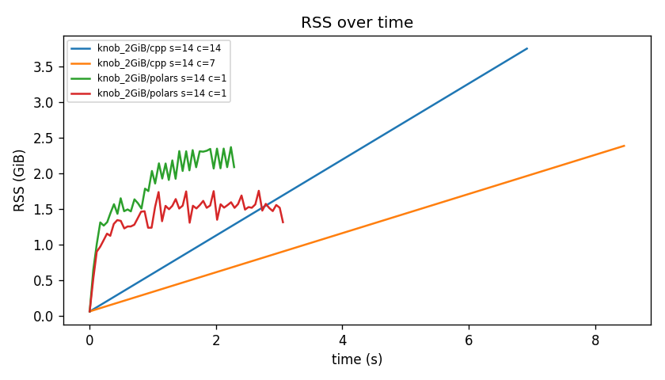

# meds_sort memory stress benchmark

## Environment

- **platform**: macOS-26.5.1-arm64-arm-64bit
- **processor**: arm
- **cpu_count**: 14
- **python**: 3.12.7
- **polars**: 1.35.2
- **pyarrow**: 22.0.0

## Runs

| label | backend | uncompressed | shards | threads | conc | status | wall best (s) | peak RSS | peak A | peak B | out size | files |
|---|---|---|---|---|---|---|---|---|---|---|---|---|
| knob_2GiB | cpp | 2.0 GiB | 14 | 2 | 2 | ok | 16.99 | 1.4 GiB | 1.1 GiB | 0.0 B | 558.3 MiB | 14 |
| knob_2GiB | cpp | 2.0 GiB | 14 | 7 | 7 | ok | 8.31 | 3.3 GiB | 2.4 GiB | 0.0 B | 558.3 MiB | 14 |
| knob_2GiB | cpp | 2.0 GiB | 14 | 14 | 14 | ok | 6.92 | 5.7 GiB | 3.8 GiB | 0.0 B | 558.3 MiB | 14 |
| knob_2GiB | polars | 2.0 GiB | 14 | 2 | 1 | ok | 7.28 | 1.4 GiB | 1.2 GiB | 1.4 GiB | 461.1 MiB | 14 |
| knob_2GiB | polars | 2.0 GiB | 14 | 7 | 1 | ok | 3.07 | 1.8 GiB | 1.5 GiB | 1.8 GiB | 461.1 MiB | 14 |
| knob_2GiB | polars | 2.0 GiB | 14 | 14 | 1 | ok | 2.30 | 2.4 GiB | 1.8 GiB | 2.4 GiB | 461.1 MiB | 14 |

## Polars / C++ ratios (lower is better for Polars)

| label | shards | threads | speed ratio | peak-RSS ratio |
|---|---|---|---|---|
| knob_2GiB | 14 | 2 | 0.43x | 1.04x |
| knob_2GiB | 14 | 7 | 0.37x | 0.54x |
| knob_2GiB | 14 | 14 | 0.33x | 0.42x |

> Note: the C++ backend has no shard-sort concurrency cap (it sorts up to num_threads shards at once), whereas Polars here uses MEDS_SORT_SHARD_CONCURRENCY. Matched-config peak RSS can therefore favor Polars when concurrency is capped.

## Equivalence checks

- OK: knob_2GiB (polars == cpp)
- OK: knob_2GiB (polars == cpp)
- OK: knob_2GiB (polars == cpp)

## Plots

### RSS over time

